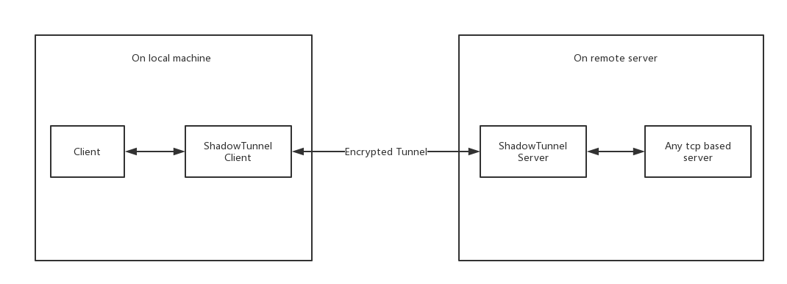

# ShadowTunnel

Tcp port forward over encrypted tunnel, like shadowsocks. 
But you can use it with any protocol you like (http/https, socks5, ssh tunnel, etc..)

# How it works?

# What can I do with shadowtunnel?

Free play time : )

# BTW

NON-POLITICAL !!!

Hail China!